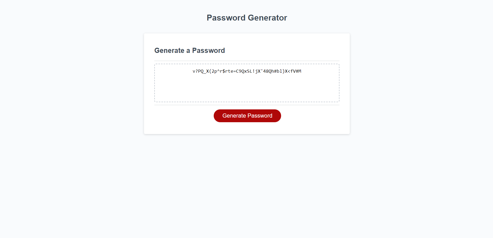

# Random Password Generator

## Description

Generates a random password between 8-128 characters in length, with possible characters being lowercase, uppercase, numeric, and/or special characters including at least one type. When the user clicks the "Generate Password button", the user is prompted to choose the length and types of characters included in the password, and then a password generated to their specifications is displayed.

## Screenshot

## Link to Deployed Application

https://jacobpudwill.github.io/Random-Password-Generator/
